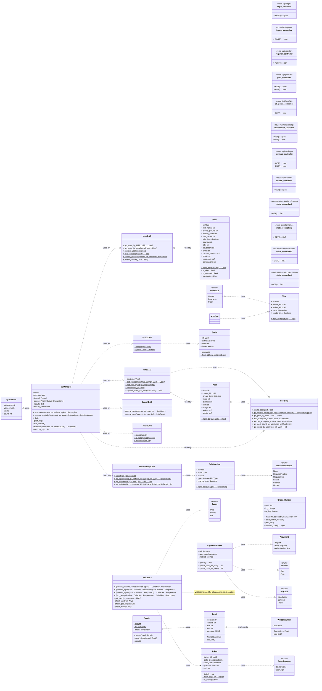

```mermaid
classDiagram
direction RL
%% namespace Authorization {
    class login_controller {
        <<route /api/login>>
        + POST() : json
    }

    class logout_controller {
        <<route /api/logout>>
        + POST() : json
    }

    class register_controller {
        <<route /api/register>>
        + POST() : json
    }
%% }  %% namespace Authorization

%% namespace Posts {
    class post_controller {
        <<route /api/post/:id>>
        + GET() : json
        + PUT() : json
    }

    class all_posts_controller {
        <<route /api/post/all>>
        + GET() : json
    }
%% }  %% namespace Posts

%% namespace Relationships {
    class relationship_controller {
        <<route /api/relationship>>
        + GET() : json
        + PUT() : json
    }
%% }  %% namespace Relationships

%% namespace Settings {
    class settings_controller {
        <<route /api/settings>>
        + GET() : json
        + PUT() : json
    }
%% }  %% namespace Settings

class search_controller {
    <<route /api/search>>
    + GET() : json
}

%% namespace Static {
    class static_controller1 {
        <<route /static/uploads/:id/:name>>
        + GET() : file?
    }

    class static_controller2 {
        <<route /assets/:name>>
        + GET() : file?
    }

    class static_controller3 {
        <<route /assets/:dir/:name>>
        + GET() : file?
    }

    class static_controller4 {
        <<route /assets/:dir1/:dir2/:name>>
        + GET() : file?
    }
%% } %%  namespace Static

class DBManager {
    - cursor
    - running: bool
    - thread: Thread
    - queue: PriorityQueue~QueueItem~
    - results: dict
    + execute(statement: str, values: tuple) : list~tuple~
    + execute_multiple(statement: str, values: list~tuple~) : list~list~tuple~~
    + die()
    - post_init()
    - restart_connection
    - run_forever()
    - execute(statement: str, values: tuple) : list~tuple~
    - random_id() : int
}


class QueueItem {
    + statement: str
    + values: tuple
    + id: int
    + count: int
}

class User {
    + id: Uuid
    + first_name: str
    + profile_picture: str
    + middle_name: str
    + last_name: str
    + join_time: datetime
    + country: str
    + city: str
    + education: str
    + extra: str
    + banner_picture: str?
    + email: str
    + password: str?
    + permissions: int
    + from_db(row: tuple)$: User
    + is_ok(): bool
    + is_admin(): bool
    + sanitize(): User
}

class UserDAO {
    + get_user_by_id(id: Uuid)$ : User?
    + get_user_by_email(email: str)$ : User?
    + register_user(user: User)$
    + user_exists(email: str)$ : bool
    + correct_password(email: str, password: str)$ : bool
    + delete_user(id_: uuid.UUID)$
}

class Post {
    + id: Uuid
    + owner_id: Uuid
    + create_time: datetime
    + likes: int
    + dislikes: int
    + text: str
    + image: str?
    + video: str?
    + audio: str?
    + from_db(row: tuple)$: Post
}

class PostDAO {
    + create_post(post: Post)$
    + get_visible_posts(user: Post?, start: int, end: int)$: list~PostWrapper~
    + get_post_by_id(id: Uuid): Post?
    + add_vote(post_id: Uuid, vote: Vote.Value)
    + remove_vote(post_id: Uuid, vote: Vote.Value)
    + get_post_count_by_user(user_id: Uuid): int
    + get_score_by_user(user_id: Uuid): int
}

class Relationship {
    + id: Uuid
    + from: Uuid
    + to: Uuid
    + type: Relationship.Type
    + change_time: datetime
    + from_db(row: tuple)$: Relationship
}

class RelationshipDAO {
    + upsert(rel: Relationship)$
    + get_relationship_by_id(from_id: Uuid, to_id: Uuid)$: Relationship?
    + get_relationship(id1: Uuid, id2: Uuid)$: dict
    + get_relationship_count(user_id: Uuid, type: Relationship.Type)$: int
}

class RelationshipType {
    <<enum>>
    None
    RequestPending
    RequestSent
    Friend
    Blocked
    Hidden
}

class ScriptDAO {
    + add(script: Script)$
    + get(id: Uuid)$: Script?
}

class Script {
    + id: Uuid
    + author_id: Uuid
    + code: str
    + fernet: Fernet
    + encrypt()
    + from_db(row: tuple)$: Script
}

class SearchDAO {
    + search_name(prompt: str, max: int): list~User~
    + search_page(prompt: str, max: int): list~Page~
}

class TokenDAO {
    + insert(jwt: str)$
    + is_valid(jwt: str)$: bool
    + invalidate(jwt: str)$
}

class Vote {
    + id: Uuid
    + parent_id: Uuid
    + author_id: Uuid
    + value: VoteValue
    + create_time: datetime
    + from_db(row: tuple)$: Vote
}

class VoteDAO {
    + add(vote: Vote)$
    + get_vote(parent: Uuid, author: Uuid)$: Vote?
    + get_vote_by_id(id: Uuid)$: Vote?
    + delete(vote_id: Uuid)$
    + update_votes_for_post(post: Post): Post
}

class VoteValue {
    <<enum>>
    Upvote
    Downvote
    Clear
}

DBManager ..|> QueueItem : uses
PostDAO <|.. DBManager : used by
RelationshipDAO <|.. DBManager : used by
ScriptDAO <|.. DBManager : used by
SearchDAO <|.. DBManager : used by
TokenDAO <|.. DBManager : used by
UserDAO <|.. DBManager : used by
VoteDAO <|.. DBManager : used by

PostDAO ..|> Post : uses
Relationship <|.. RelationshipDAO : uses
RelationshipType <.. Relationship : uses
Script <|.. ScriptDAO : uses
User ..|> UserDAO: used by
Vote <|.. VoteDao : uses
Post ..|> VoteDAO : used by
PostDAO <|.. VoteDAO : uses
Vote ..|> VoteValue : uses

%% namespace QrCode {
    class QrCodeBuilder {
        - data: str
        - logo: Image
        - qr_img: Image
        + make(fill_color: str?, back_color: str?)
        + save(author_id: Uuid)
        - post_init()
        - random_color(): tuple
    }
%% }  %% namespace QrCode

class Email {
    - receiver: str
    - subject: str
    - text: str
    - html: str
    - message: MIME
    + format()*: Email
    - post_init()
}

class WelcomeEmail {
    - user: User
    + format() -> Email
    - post_init()
}

class Sender {
    - FROM$
    - PASSWORD$
    - mails: list~Email~
    + queue(email: Email)$
    - send_single(email: Email)$
    - send()$
}

Email ..> Sender : uses
WelcomeEmail --|> Email : implements

class ArgumentParser {
    - url: Request
    - args: set~Argument~
    - method: Method
    + parse(): dict
    + parse_body_as_text(): str
    + parse_body_as_json(): str
}

class Argument {
    - key: str
    - type: ArgType
    - defaultValue: Any
}

class ArgType {
    <<enum>>
    Mandatory
    Optional
    Prefix
}

class Method {
    <<enum>>
    Get
    Post
}

class Validators {
    + @check_params(names: dict~strType~): Callable~...Response~
    + @needs_login(func: Callable~...Response~): Callable~...Response~
    + @needs_logout(func: Callable~...Response~): Callable~...Response~
    + @log_endpoint(func: Callable~...Response~): Callable~...Response~
    - get_user_in_request(): Uuid?
    - check_uuid(val: Any)
    - check_pos_int(val: Any)
    - check_file(val: Any)
}

class Types {
    <<enum>>
    Uuid
    PosInt
    File
}

class Token {
    + owner_id: Uuid
    + date_created: datetime
    + valid_until: datetime
    + purpose: Purpose
    + rnd: str
    + build(): str
    + from_str(s: str)$: Token
    + is_valid(): bool
}

class TokenPurpose {
    <<enum>>
    DeleteProfile
    UserLogin
}

TokenPurpose <|.. Token : uses
ArgType <|.. ArgumentParser : uses
Method <|.. ArgumentParser : uses
Argument <|.. ArgumentParser : uses
Types <.. Validators : uses
Token <.. Validators : uses

note for Validators "Validations used for all endpoints as decorators"
```
