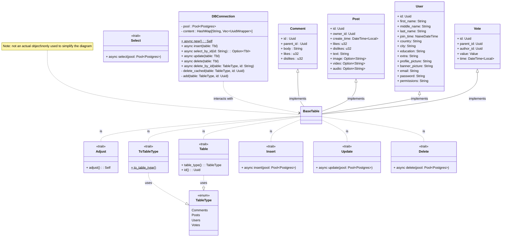

```mermaid
classDiagram
    direction TB
    class DBConnection {
        - pool : Pool~Postgres~
        - content : HashMap[String, Vec~UuidWrapper~]
        + async new()$ : Self
        + async insert(table: Tbl)
        + async select_by_id(id: String) : Option~Tbl~
        + async update(table: Tbl)
        + async delete(table: Tbl)
        + async delete_by_id(table: TableType, id: String)
        - delete_cached(table: TableType, id: Uuid)
        - add(table: TableType, id: Uuid)
    }

    class Adjust {
        <<trait>>
        + adjust() : Self
    }

    class Table {
        <<trait>>
        + table_type() : TableType
        + id() : Uuid
    }

    class ToTableType {
        <<trait>>
        + to_table_type()$
    }

    class Insert {
        <<trait>>
        + async insert(pool: Pool~Postgres~)
    }

    class Select {
        <<trait>>
        + async select(pool: Pool~Postgres~)
    }

    class Update {
        <<trait>>
        + async update(pool: Pool~Postgres~)
    }

    class Delete {
        <<trait>>
        + async delete(pool: Pool~Postgres~)
    }


    class TableType {
        <<enum>>
        Comments
        Posts
        Users
        Votes
    }

    class User {
        + id: Uuid
        + first_name: String
        + middle_name: String
        + last_name: String
        + join_time: NaiveDateTime
        + country: String
        + city: String
        + education: String
        + extra: String
        + profile_picture: String
        + banner_picture: String
        + email: String
        + password: String
        + permissions: String
    }

    class Comment {
        + id : Uuid
        + parent_id : Uuid
        + body : String
        + likes : u32
        + dislikes : u32
    }

    class Post {
        + id: Uuid
        + owner_id: Uuid
        + create_time: DateTime~Local~
        + likes: u32
        + dislikes: u32
        + text: String
        + image: Option~String~
        + video: Option~String~
        + audio: Option~String~
    }

    class Vote {
        + id: Uuid
        + parent_id: Uuid
        + author_id: Uuid
        + value: Value
        + time: DateTime~Local~
    }

    DBConnection ..> BaseTable : interacts with

    BaseTable .. Adjust : is
    BaseTable .. Delete : is
    BaseTable .. Insert : is
    BaseTable .. Table : is
    BaseTable .. ToTableType : is
    BaseTable .. Update : is
    
    note for BaseTable "Note: not an actual object\nonly used to simplify the diagram"

    Comment <|-- BaseTable : implements
    Post <|-- BaseTable : implements
    User <|-- BaseTable : implements
    Vote <|-- BaseTable : implements

    ToTableType ..|> TableType : uses
    Table ..|> TableType : uses
```
